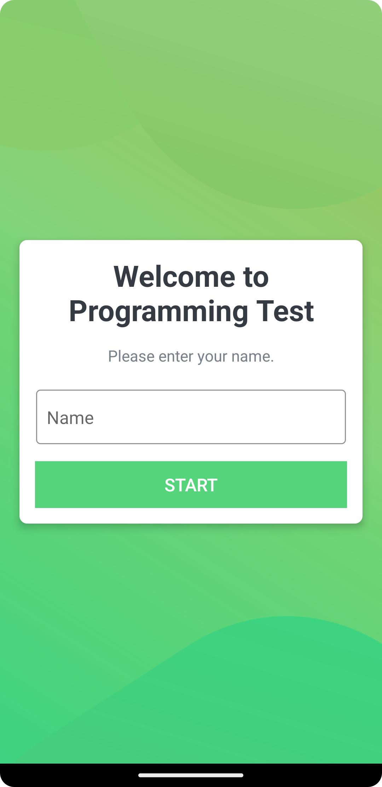
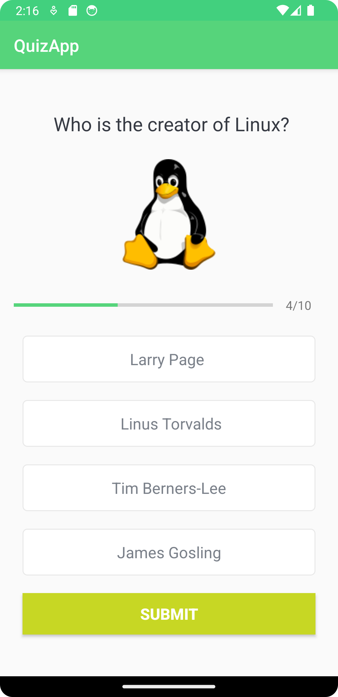

# Kotlin Quiz Application

This is a simple Quiz application developed using Kotlin and Android Studio. The application allows users to answer a few specific questions without any time limits and displays their results.

## Features

- Basic question-answer game

## Screenshots





## Nasıl Çalıştırılır

## How to Run

1. Clone this repository to your computer:

```bash
[git clone https://github.com/username/project-name.git](https://github.com/mertncu/QuizApplication.git)https://github.com/mertncu/QuizApplication.git
```
2. Open Android Studio.
3. Select "Open" from the "File" menu and choose the folder where the project is located.
4. Select the app module inside the project and click the "Run" button to run the application.

